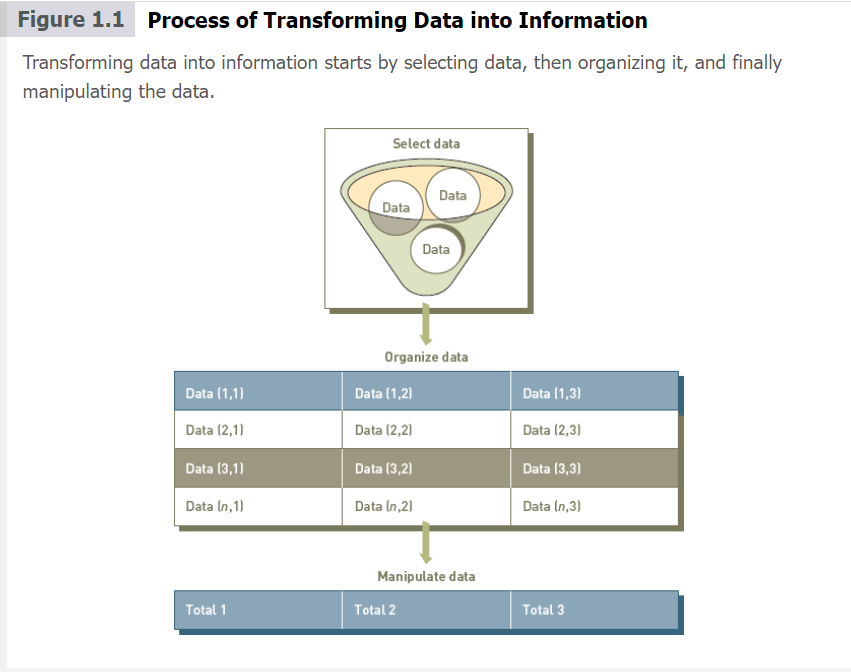
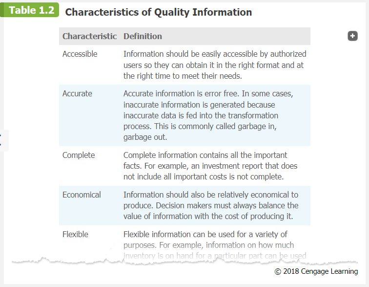
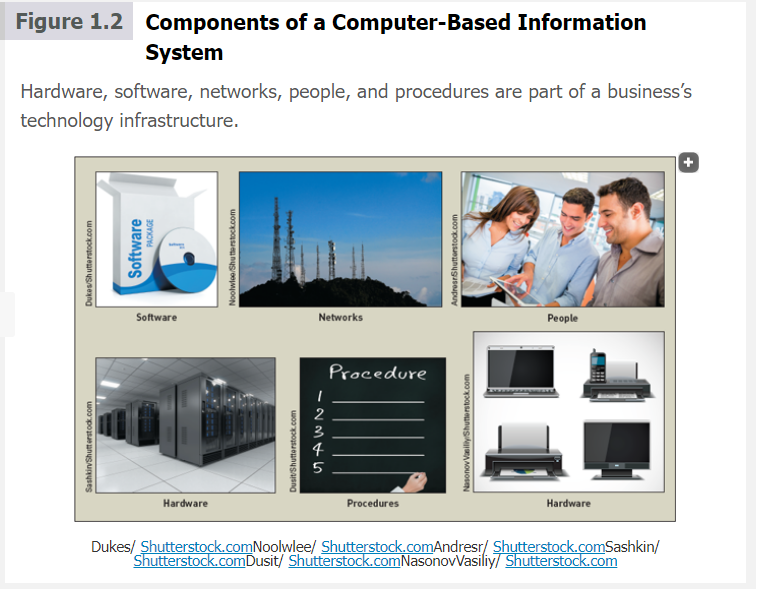
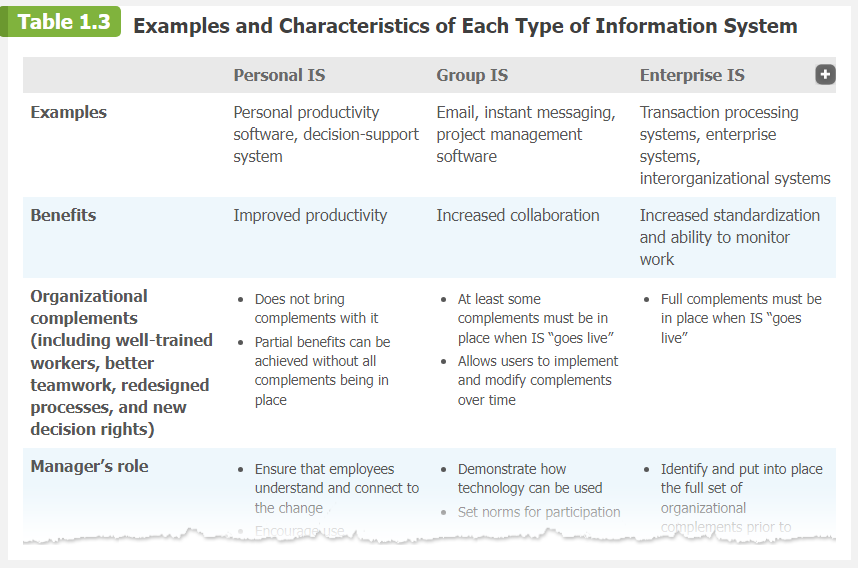
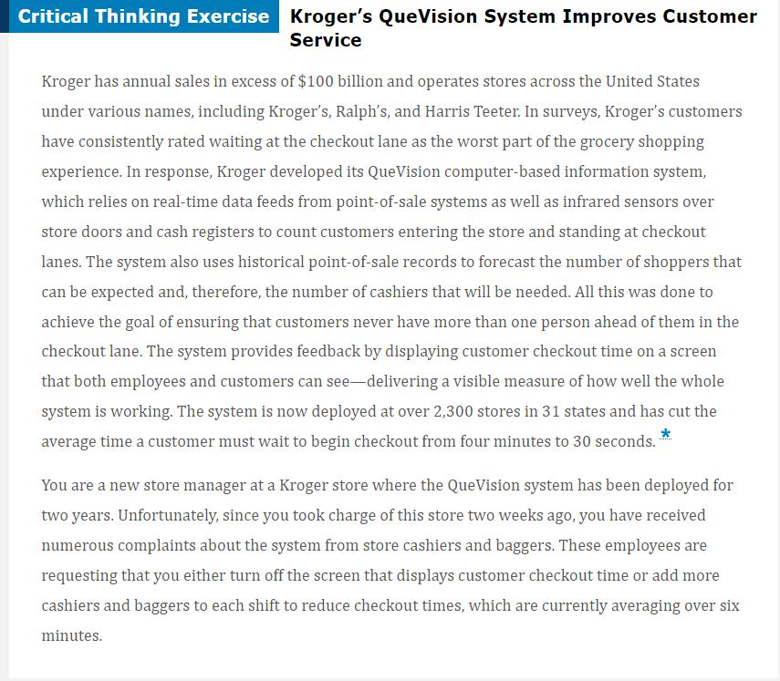

## Information system in perspective

### Unit 1 : An introduction to information systems 

### Unit 1 read
### Unit 1 preview
### Learning Objectives
- Distinguish data from information and knowledge, and describe the characteristics of quality data.
- Identify the fundamental components of an information system and describe their function.
- Identify the three fundamental information system types and explain what organizational complements must be in place to ensure successful implementation and use of the system.
- Identify and briefly describe the role of each component of an organization’s technology infrastructure.
- Identify the basic types of business information systems, including who uses them, how they are used, and what kinds of benefits they deliver.
- Describe how organizations are using business intelligence and business analytics to capitalize on the vast amount of data becoming available.
- Discuss why it is critical for business objectives and IS activities to be well aligned through system planning, development, and acquisition.
- Identify several major IT security threats as well as some of the legal, social, and ethical issues associated with information systems.

### Part 1: Information Sytems in Perspective
> We begin by examining the topics covered in “Part 1: Information Systems in Perspective,” which includes an “An Introduction to Information Systems” and a discussion of “Information Systems in Organizations.”

Information is a certral concept of this book. The term is used in the title of the book, in this section, and in every chapter. To be an effective manager in any area 
of business, you need to understand that information is one of organizations's most valuble resourses. Information is no  the same thing as data , and knowledge is different from both data and information. These concepts will now be explained.

### Data, Information , and Knowledge 
**Data** consists of raw facts, such as an employee number, total hours worked in a week, an inventory part number, or the number of units peoduced on a production line. As shown in **Table 1.1** several types of data can represent these facts. 

**Information** is a collection of data organized and processed so that it has additional value beyond the value of the individual facts. For example, a sales data summarized so it shows the total sales for the month. providing information to customers can also help companies increase revenues and profits.For example , social shopping Wed site Kaboodle brings shoppers and sellers together electronically so they can share information and make recommendations while shopping online. The free exchange of information stimulates sales and helps ensure shoppers find better values.
 ### Table 1.1 types of data 
 |Data                       |Represented by 
 |---------------------------|--------------------------------------|
 |Alphanumeric data          |Numbers, letters, and other characters
 |Audio data                 |Sounds, noises,or tones
 |Image data                 |Graphic images and pictures 
 |Video dataw                |Moving images or pictures
 
Another way to appreciate the difference between data and information is to think of data as the individual items in a grocery list—crackers, bread, soup, cereal, coffee, dishwashing soap, and so on. The grocery list becomes much more valuable if the items in the list are arranged in order by the aisle in which they are found in the store—bread and cereal in aisle 1, crackers and soup in aisle 2, and so on. Data and information work the same way. Rules and relationships can be set up to organize data so it becomes useful, valuable information.

The value of the information created depends on the relationships defined among existing data. For instance, you could add specific identifiers to the items in the list to ensure that the shopper brings home the correct item—whole wheat bread and Kashi cereal in aisle 1, saltine crackers and chicken noodle soup in aisle 2, and so on. By doing so, you create a more useful grocery list.

Turning data into information is a **process**, or a set of logically related tasks performed to achieve a defined outcome. The process of defining relationships among data to create useful information requires **knowledge**, which is the awareness and understanding of a set of information and the ways in which that information can be made useful to support a specific task or reach a decision.

 In other words, information is essentially data made more useful through the application of knowledge. For instance, there are many brands and varieties of most items on a typical grocery list. To shop effectively, the grocery shopper needs to have an understanding of the needs and desires of those being shopped for so that he knows to purchase one can of Campbell’s (not the store brand!) low-sodium chicken noodle soup for the family member who is diabetic along with two cans of Campbell’s regular chicken noodle soup for everyone else.

 In some cases, people organize or process data mentally or manually. In other cases, they use a computer. This transformation process is shown in **Figure 1.1**.

 

 ### The Value of Information
 The value of information is directly linked to how it helps decision makers achieve their organization’s goals. Valuable information can help people perform tasks more efficiently and effectively. Many businesses assume that reports are based on correct, quality information, but, unfortunately, that is not always true. For example, Experian (a global information services firm that provides credit services, marketing services, decision analytics, and consumer services) estimates that on average, 22 percent of an organization’s customer contact data is wrong.Footnote Companies can easily waste over $100 per inaccurate customer contact data record on things like direct-mail marketing sent to wrong addresses and the inability to properly track leads. For an organization with 100,000 customers and a 22 percent error rate, that projects to a loss of $2.2 million.Footnote

### Characteristics of quality Information
Fundamental to the quality of a decision is the quality of the information used to reach that decision. Any organization that stresses the use of advanced information systems and sophisticated data analysis before information quality is doomed to make many wrong decisions. Table 1.2 lists the characteristics that determine the quality of information. The importance of each of these characteristics varies depending on the situation and the kind of decision you are trying to make. For example, with market intelligence data, some inaccuracy and incompleteness is acceptable, but timeliness is essential. Market intelligence data may alert you that a competitor is about to make a major price cut. The exact details and timing of the price cut may not be as important as being warned far enough in advance to plan how to react. On the other hand, accuracy and completeness are critical for data used in accounting for the management of company assets, such as cash, inventory, and equipment.

### What is an information system?
Another central concept of this book is that of an information system. People and organizations use information systems every day. An **information system (IS)** is a set of interrelated components that collect, process, store, and disseminate data and information; an information system provides a feedback mechanism to monitor and control its operation to make sure it continues to meet its goals and objectives. The feedback mechanism is critical to helping organizations achieve their goals, such as increasing profits or improving customer service.

A **computer-based information system (CBIS)** is a single set of hardware, software, databases, networks, people, and procedures that are configured to collect, manipulate, store, and process data into information. Increasingly, companies are incorporating computer-based information systems into their products and services. Investment companies offer their customers a wide range of powerful investment tools, including access to extensive online research. Automobiles are available with advanced navigation systems that not only guide you to your destination but also incorporate information regarding the latest weather and traffic conditions to help you avoid congestion and traffic delays. Watches, digital cameras, mobile phones, music players, and other devices rely on CBIS to bring their users the latest and greatest features.

The components of a CBIS are illustrated in Figure 1.2. An organization’s technology infrastructure includes all the hardware, software, databases, networks, people, and procedures that are configured to collect, manipulate, store, and process data into information. The technology infrastructure is a set of shared IS resources that form the foundation of each computer-based information system.

People make the difference between success and failure in all organizations. Jim Collins, in his book, Good to Great, said, “Those who build great companies understand that the ultimate throttle on growth for any great company is not markets, or technology, or competition, or products. It is one thing above all others: the ability to get and keep enough of the right people.”Footnote Thus, it comes as no surprise that people are the most important element in computer-based information systems.

Good systems can enable people to produce extraordinary results. They can also boost job satisfaction and worker productivity.Footnote Information systems personnel include all the people who manage, run, program, and maintain the system, including the chief information officer (CIO), who leads the IS organization. End users are people who work directly with information systems to get results. They include financial executives, marketing representatives, and manufacturing line operators.

A **procedure** defines the steps to follow to achieve a specific end result, such as enter a customer order, pay a supplier invoice, or request a current inventory report. Good procedures describe how to achieve the desired end result, who does what and when, and what to do in the event something goes wrong. When people are well trained and follow effective procedures, they can get work done faster, cut costs, make better use of resources, and more easily adapt to change. When procedures are well documented, they can greatly reduce training costs and shorten the learning curve.

Using a CBIS involves setting and following many procedures, including those for the operation, maintenance, and security of the system. For example, some procedures describe how to gain access to the system through the use of some log-on procedure and a password. Others describe who can access facts in the database or what to do if a disaster, such as a fire, earthquake, or hurricane, renders the CBIS unusable. Good procedures can help companies take advantage of new opportunities and avoid lengthy business disruptions in the event of natural disasters. Poorly developed and inadequately implemented procedures, however, can cause people to waste their time on useless rules or result in inadequate responses to disasters.

## Information Systems in Organizations
Most organizations have a number of different information systems. When considering the role of business managers in working with IS, it is useful to divide information systems into three types: personal IS, group IS, and enterprise IS.

**Personal IS** includes information systems that improve the productivity of individual users in performing stand-alone tasks. Examples include personal productivity software, such as word-processing, presentation, and spreadsheet software.

In today’s fast-moving, global work environment, success depends on our ability to communicate and collaborate with others, including colleagues, clients, and customers. Group IS includes information systems that improve communications and support collaboration among members of a workgroup. Examples include Web conferencing software, wikis, and electronic corporate directories.

**Enterprise IS** includes information systems that organizations use to define structured interactions among their own employees and/or with external customers, suppliers, government agencies, and other business partners. Successful implementation of these systems often requires the radical redesign of fundamental work processes and the automation of new processes. Target processes may include purely internal activities within the organization (such as payroll) or those that support activities with external customers and suppliers (order processing and purchasing). Three examples of enterprise IT are transaction processing, enterprise, and interorganizational systems.

For each type of IS, certain key **organizational complements** must be in place to ensure successful implementation and use of the system. These complements include:

- **Well-trained workers.** Employees must be well trained and understand the need for the new system, what their role is in using or operating the system, and how to get the results they need from the system.

- **System support.** Trained and experienced users who can show others how to gain value from the system and overcome start-up problems.
- **Better teamwork.** Employees must understand and be motivated to work together to achieve the anticipated benefits of the system.
- **Redesigned processes.** New systems often require radical redesign of existing work processes as well as the automation of new processes.
- **New decision rights.** Employees must understand and accept their new roles and responsibilities including who is responsible for making what decisions. Roles and responsibilities often change with introduction of a new system.

Managers have an essential role to play in the successful implementation and use of information systems. That role changes depending on which type of IS system is being implemented, as shown in **Table 1.3**, which also highlights other characteristics and provides examples of each type.

# Information Technology Concepts

Next, we look at the topics covered in “Part 2: Information Technology Concepts,” including “Hardware and Mobile Devices,” “Software and Mobile Applications,” “Database Systems and Big Data,” and “Networks and Cloud Computing.” This discussion will help you understand basic concepts and prepare you for more in-depth coverage in the individual chapters.

# Hardware and Mobile Devices

**Hardware** consists of computer equipment used to perform input, processing, storage, and output activities. The trend in the computer industry is to produce smaller, faster, and more mobile hardware, such as smartphones, laptops, and tablet computers. In addition, hardware manufacturers and entrepreneurs are hard at work developing innovative new hardware devices, such as the following:

- Advanced keyboards that turn individual keys on a keyboard into trackpad-covered buttons where certain dual-purpose keys could be depressed to multiple levels to complete different tasks; the spacebar, for example, can serve its usual purpose. But add capacitive touch and it becomes a cursor; press a little harder to generate a mouse click. (Capacitive touch relies on the electrical properties of the human body to detect when and where on a display the user touches. Because of this, capacitive displays can be controlled with very light touches of a finger.)
- Laptops and displays that connect wirelessly, thus eliminating the need for expensive HDMI or DisplayPort display cables
- Computing devices with embedded 3D cameras, which will be able to recognize objects and even measure distances between things
- Keyboards that enable users to log in to Web sites via fingerprint authentication so they won’t have to remember dozens of passwords for different sites
- Very-high resolution display devices that will show content in incredible detail and dramatically improve the viewing experience (think clarity and resolution way beyond 1080p HD)
- Computerized event data recorders (EDRs) that, like an airplane’s black box, record vehicle speed, possible engine problems, driver performance, and more

While desktop, laptop, and tablet computers continue to be used in a variety of settings, smartphones have become the primary device used by people around the world to communicate, go online, and access and share information. In 2013, the number of smartphone users first exceeded the number of personal computer users, and the gap keeps growing, with the number of smartphones sold worldwide far exceeding the combined sale of desktops, laptops, and tablets as shown in Figure 1.3. This rapid growth has been spurred by the improving affordability and capability of smartphones, the increasing speed and coverage of wireless networks, longer battery life, and the availability of hundreds of thousands of smartphone applications and games. For many people in developing countries, a smartphone is their first computer and their only Internet-connected device. For those in developed countries, it is common for individuals who do have a computer to also have a smartphone. It is projected that roughly one-third of the world’s population will own a smartphone by 2018.Footnote

stoped at 1-2b

