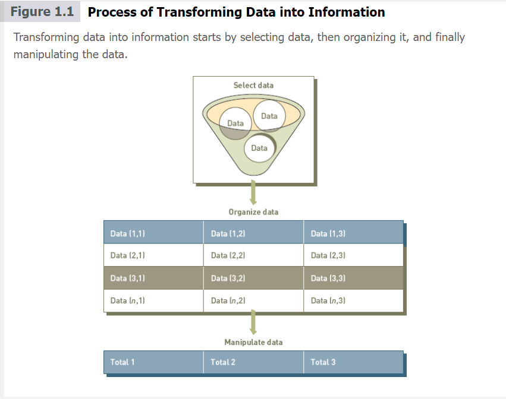
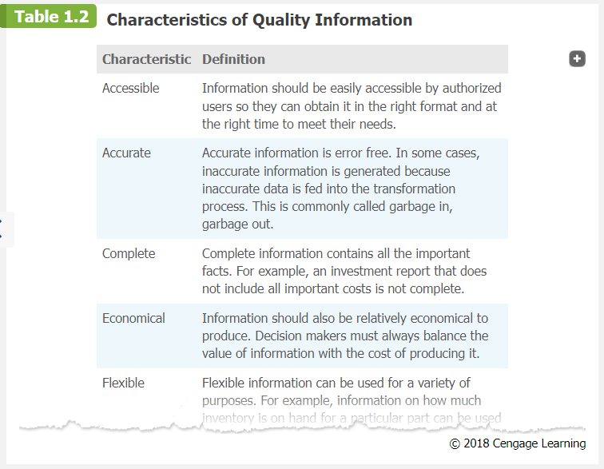
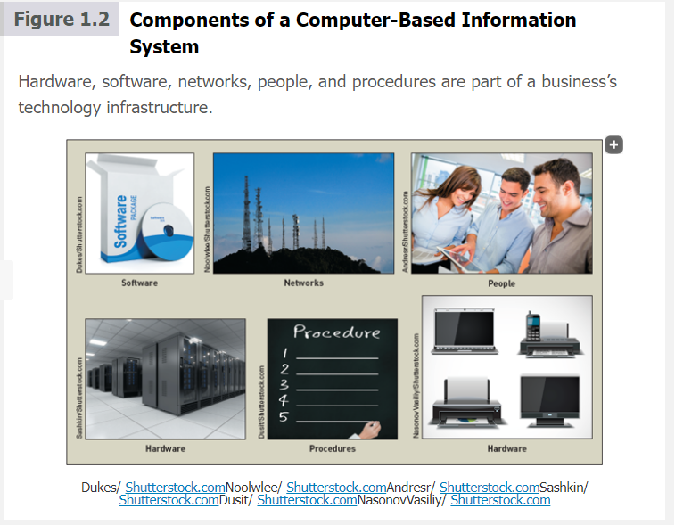
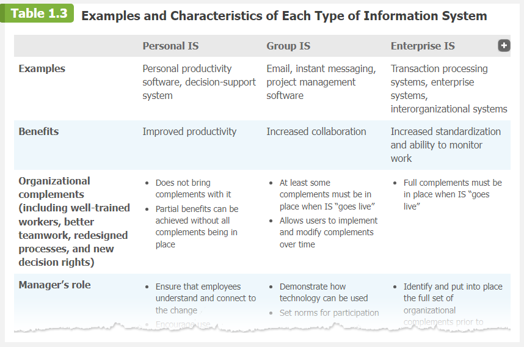
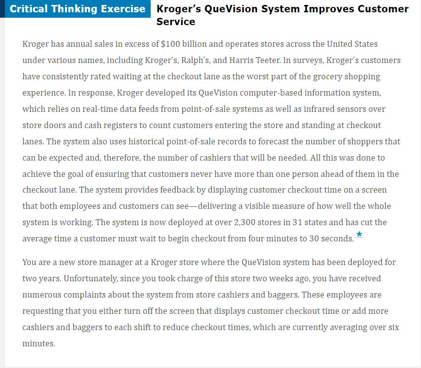
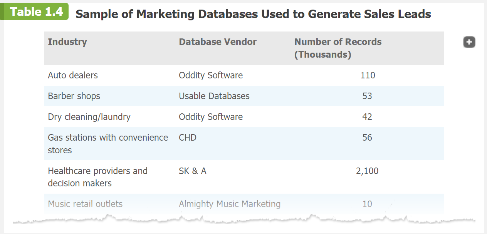
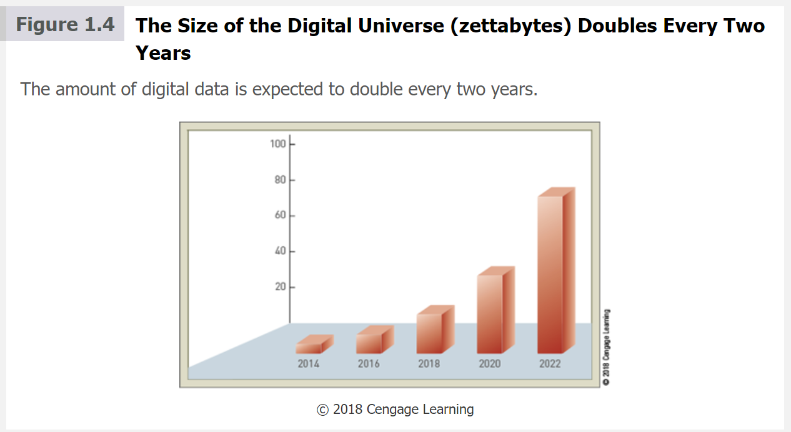
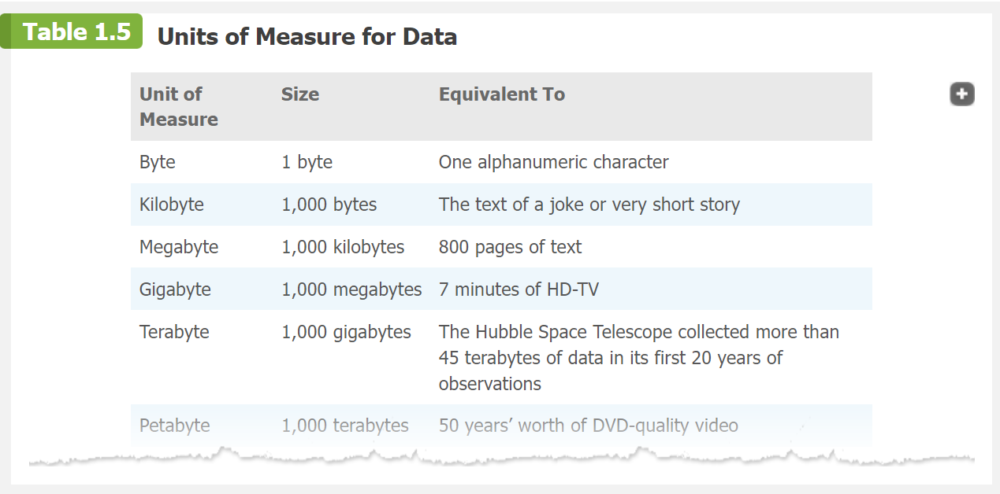
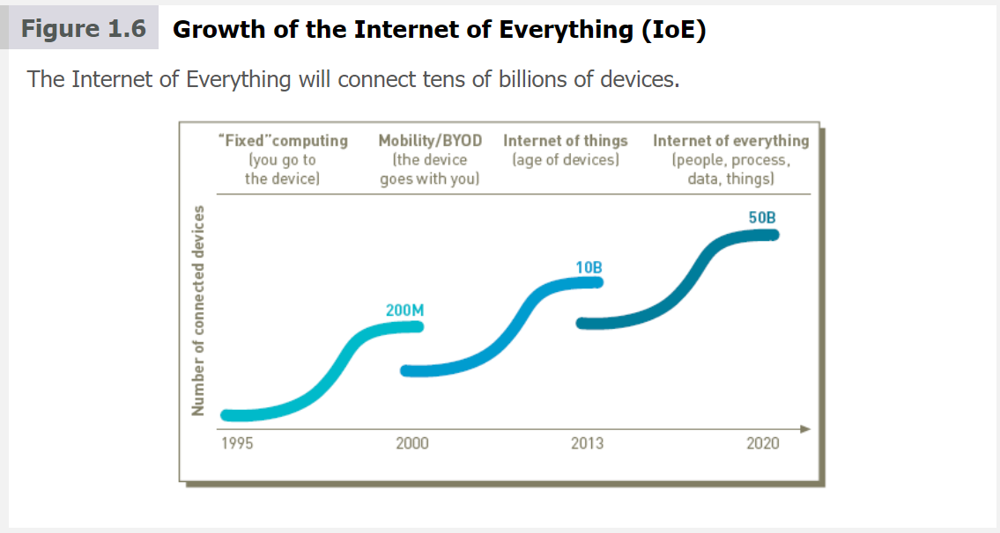
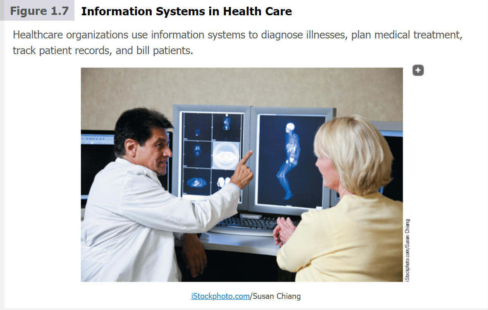

mv # Information system in perspective

### Unit 1 : An introduction to information systems 

### Unit 1 read
### Unit 1 preview
### Learning Objectives
- Distinguish data from information and knowledge, and describe the characteristics of quality data.
- Identify the fundamental components of an information system and describe their function.
- Identify the three fundamental information system types and explain what organizational complements must be in place to ensure successful implementation and use of the system.
- Identify and briefly describe the role of each component of an organization’s technology infrastructure.
- Identify the basic types of business information systems, including who uses them, how they are used, and what kinds of benefits they deliver.
- Describe how organizations are using business intelligence and business analytics to capitalize on the vast amount of data becoming available.
- Discuss why it is critical for business objectives and IS activities to be well aligned through system planning, development, and acquisition.
- Identify several major IT security threats as well as some of the legal, social, and ethical issues associated with information systems.

### Part 1: Information Sytems in Perspective
> We begin by examining the topics covered in “Part 1: Information Systems in Perspective,” which includes an “An Introduction to Information Systems” and a discussion of “Information Systems in Organizations.”

Information is a certral concept of this book. The term is used in the title of the book, in this section, and in every chapter. To be an effective manager in any area 
of business, you need to understand that information is one of organizations's most valuble resourses. Information is no  the same thing as data , and knowledge is different from both data and information. These concepts will now be explained.

### Data, Information , and Knowledge 
**Data** consists of raw facts, such as an employee number, total hours worked in a week, an inventory part number, or the number of units peoduced on a production line. As shown in **Table 1.1** several types of data can represent these facts. 

**Information** is a collection of data organized and processed so that it has additional value beyond the value of the individual facts. For example, a sales data summarized so it shows the total sales for the month. providing information to customers can also help companies increase revenues and profits.For example , social shopping Wed site Kaboodle brings shoppers and sellers together electronically so they can share information and make recommendations while shopping online. The free exchange of information stimulates sales and helps ensure shoppers find better values.
 ### Table 1.1 types of data 
 |Data                       |Represented by 
 |---------------------------|--------------------------------------|
 |Alphanumeric data          |Numbers, letters, and other characters
 |Audio data                 |Sounds, noises,or tones
 |Image data                 |Graphic images and pictures 
 |Video dataw                |Moving images or pictures
 
Another way to appreciate the difference between data and information is to think of data as the individual items in a grocery list—crackers, bread, soup, cereal, coffee, dishwashing soap, and so on. The grocery list becomes much more valuable if the items in the list are arranged in order by the aisle in which they are found in the store—bread and cereal in aisle 1, crackers and soup in aisle 2, and so on. Data and information work the same way. Rules and relationships can be set up to organize data so it becomes useful, valuable information.

The value of the information created depends on the relationships defined among existing data. For instance, you could add specific identifiers to the items in the list to ensure that the shopper brings home the correct item—whole wheat bread and Kashi cereal in aisle 1, saltine crackers and chicken noodle soup in aisle 2, and so on. By doing so, you create a more useful grocery list.

Turning data into information is a **process**, or a set of logically related tasks performed to achieve a defined outcome. The process of defining relationships among data to create useful information requires **knowledge**, which is the awareness and understanding of a set of information and the ways in which that information can be made useful to support a specific task or reach a decision.

 In other words, information is essentially data made more useful through the application of knowledge. For instance, there are many brands and varieties of most items on a typical grocery list. To shop effectively, the grocery shopper needs to have an understanding of the needs and desires of those being shopped for so that he knows to purchase one can of Campbell’s (not the store brand!) low-sodium chicken noodle soup for the family member who is diabetic along with two cans of Campbell’s regular chicken noodle soup for everyone else.

 In some cases, people organize or process data mentally or manually. In other cases, they use a computer. This transformation process is shown in **Figure 1.1**.

 

 ### The Value of Information
 The value of information is directly linked to how it helps decision makers achieve their organization’s goals. Valuable information can help people perform tasks more efficiently and effectively. Many businesses assume that reports are based on correct, quality information, but, unfortunately, that is not always true. For example, Experian (a global information services firm that provides credit services, marketing services, decision analytics, and consumer services) estimates that on average, 22 percent of an organization’s customer contact data is wrong.Footnote Companies can easily waste over $100 per inaccurate customer contact data record on things like direct-mail marketing sent to wrong addresses and the inability to properly track leads. For an organization with 100,000 customers and a 22 percent error rate, that projects to a loss of $2.2 million.Footnote

### Characteristics of quality Information
Fundamental to the quality of a decision is the quality of the information used to reach that decision. Any organization that stresses the use of advanced information systems and sophisticated data analysis before information quality is doomed to make many wrong decisions. Table 1.2 lists the characteristics that determine the quality of information. The importance of each of these characteristics varies depending on the situation and the kind of decision you are trying to make. For example, with market intelligence data, some inaccuracy and incompleteness is acceptable, but timeliness is essential. Market intelligence data may alert you that a competitor is about to make a major price cut. The exact details and timing of the price cut may not be as important as being warned far enough in advance to plan how to react. On the other hand, accuracy and completeness are critical for data used in accounting for the management of company assets, such as cash, inventory, and equipment.

### What is an information system?
Another central concept of this book is that of an information system. People and organizations use information systems every day. An **information system (IS)** is a set of interrelated components that collect, process, store, and disseminate data and information; an information system provides a feedback mechanism to monitor and control its operation to make sure it continues to meet its goals and objectives. The feedback mechanism is critical to helping organizations achieve their goals, such as increasing profits or improving customer service.

A **computer-based information system (CBIS)** is a single set of hardware, software, databases, networks, people, and procedures that are configured to collect, manipulate, store, and process data into information. Increasingly, companies are incorporating computer-based information systems into their products and services. Investment companies offer their customers a wide range of powerful investment tools, including access to extensive online research. Automobiles are available with advanced navigation systems that not only guide you to your destination but also incorporate information regarding the latest weather and traffic conditions to help you avoid congestion and traffic delays. Watches, digital cameras, mobile phones, music players, and other devices rely on CBIS to bring their users the latest and greatest features.

The components of a CBIS are illustrated in Figure 1.2. An organization’s technology infrastructure includes all the hardware, software, databases, networks, people, and procedures that are configured to collect, manipulate, store, and process data into information. The technology infrastructure is a set of shared IS resources that form the foundation of each computer-based information system.

People make the difference between success and failure in all organizations. Jim Collins, in his book, Good to Great, said, “Those who build great companies understand that the ultimate throttle on growth for any great company is not markets, or technology, or competition, or products. It is one thing above all others: the ability to get and keep enough of the right people.”Footnote Thus, it comes as no surprise that people are the most important element in computer-based information systems.

Good systems can enable people to produce extraordinary results. They can also boost job satisfaction and worker productivity.Footnote Information systems personnel include all the people who manage, run, program, and maintain the system, including the chief information officer (CIO), who leads the IS organization. End users are people who work directly with information systems to get results. They include financial executives, marketing representatives, and manufacturing line operators.

A **procedure** defines the steps to follow to achieve a specific end result, such as enter a customer order, pay a supplier invoice, or request a current inventory report. Good procedures describe how to achieve the desired end result, who does what and when, and what to do in the event something goes wrong. When people are well trained and follow effective procedures, they can get work done faster, cut costs, make better use of resources, and more easily adapt to change. When procedures are well documented, they can greatly reduce training costs and shorten the learning curve.

Using a CBIS involves setting and following many procedures, including those for the operation, maintenance, and security of the system. For example, some procedures describe how to gain access to the system through the use of some log-on procedure and a password. Others describe who can access facts in the database or what to do if a disaster, such as a fire, earthquake, or hurricane, renders the CBIS unusable. Good procedures can help companies take advantage of new opportunities and avoid lengthy business disruptions in the event of natural disasters. Poorly developed and inadequately implemented procedures, however, can cause people to waste their time on useless rules or result in inadequate responses to disasters.

# Information Systems in Organizations
Most organizations have a number of different information systems. When considering the role of business managers in working with IS, it is useful to divide information systems into three types: personal IS, group IS, and enterprise IS.

**Personal IS** includes information systems that improve the productivity of individual users in performing stand-alone tasks. Examples include personal productivity software, such as word-processing, presentation, and spreadsheet software.

In today’s fast-moving, global work environment, success depends on our ability to communicate and collaborate with others, including colleagues, clients, and customers. Group IS includes information systems that improve communications and support collaboration among members of a workgroup. Examples include Web conferencing software, wikis, and electronic corporate directories.

**Enterprise IS** includes information systems that organizations use to define structured interactions among their own employees and/or with external customers, suppliers, government agencies, and other business partners. Successful implementation of these systems often requires the radical redesign of fundamental work processes and the automation of new processes. Target processes may include purely internal activities within the organization (such as payroll) or those that support activities with external customers and suppliers (order processing and purchasing). Three examples of enterprise IT are transaction processing, enterprise, and interorganizational systems.

For each type of IS, certain key **organizational complements** must be in place to ensure successful implementation and use of the system. These complements include:

- **Well-trained workers.** Employees must be well trained and understand the need for the new system, what their role is in using or operating the system, and how to get the results they need from the system.

- **System support.** Trained and experienced users who can show others how to gain value from the system and overcome start-up problems.
- **Better teamwork.** Employees must understand and be motivated to work together to achieve the anticipated benefits of the system.
- **Redesigned processes.** New systems often require radical redesign of existing work processes as well as the automation of new processes.
- **New decision rights.** Employees must understand and accept their new roles and responsibilities including who is responsible for making what decisions. Roles and responsibilities often change with introduction of a new system.

Managers have an essential role to play in the successful implementation and use of information systems. That role changes depending on which type of IS system is being implemented, as shown in **Table 1.3**, which also highlights other characteristics and provides examples of each type.

### Software and Mobile Applications

**Software** consists of the computer programs that govern the operation of a particular computing device, be it desktop computer, laptop, tablet, smartphone, or some other device. There are two types of software: system software and application software. System software—such as Google’s Android or Apple’s iOS—oversees basic computer operations such as start-up, controls access to system resources, and manages memory and files. Application software, such as Microsoft Office, allows you to accomplish specific tasks, including editing text documents, creating graphs, and playing games. Both system software and application software are needed for all types of computers, from small handheld devices to large supercomputers. In choosing application software, you must choose software that will work with the operating system installed on your computing device.

As of June 2015, 1.6 million applications were available for devices that run under the Android operating system and roughly the same (1.5 million) available for download from Apple’s App Store.
>The number of apps for each operating system is increasing by roughly 25,000 to 50,000 per month.

Business application software can be categorized by whether it is intended to be used by an individual, a small business, or a large multinational enterprise. For example, Quicken has long been a favorite accounting application for individuals who need money management and budgeting tools to help them watch their spending, increase their savings, and avoid late fees with alerts on upcoming payment due dates. QuickBooks, an accounting application popular with small businesses, enables users to create invoices, track sales and expenses, process credit card payments, run payroll, and generate financial, tax, and sales reports. SAP ERP Financials is an accounting application used by many large, multinational organizations to manage the complexities of global accounting and reporting requirements. SAP’s software records all financial transactions in a comprehensive general ledger; supports sophisticated reporting requirements; provides management accounting tools for orders, projects, cost centers, and profit centers; enables the speedy and accurate closing of the firm’s books; and helps manage risk and compliance across accounting and finance.

An important trend in the design of business application software is the attempt to imitate the look, feel, and intuitive ease of use associated with consumer apps that can be downloaded from the Google Play Store and the Apple App Store. Indeed, usability and user-interface design are key factors in delivering apps that business users will actually use. In some organizations, employees can log on to enterprise app stores to acquire the latest company software and software upgrades. This trend of consumer technology practices influencing the way business software is designed and delivered is called the **consumerization of IT.**

CDW is a leading provider of integrated information solutions to corporate customers in small, medium, and large private and public organizations in the United States and Canada. The firm has established its App Marketplace Web site (http://appmarketplace.cdw.com) where customers’ employees can identify leading enterprise mobile app solutions. The Web site is easy to navigate with apps organized by industry and app functions. The apps there have already been vetted by CDW to perform effectively and reliably. In addition, for those needing custom mobile apps, the Web site identifies mobile app partners who have a proven track record of building, deploying, and updating top enterprise applications.

### Database Systems and Big Data

A **database** is an organized collection of facts and information, typically consisting of two or more related data files. An organization’s database can contain facts and information on customers, employees, inventory, sales, online purchases, and much more. A database is essential to the operation of a computer-based information system.

As anyone who works in marketing or sales knows, one of the biggest challenges that any business faces is the ability to generate new leads in an effort to locate customers. As businesses have looked for ways to meet this challenge, numerous vendors have seized the opportunity by offering access to databases of potential clients in various industries, as shown in **Table 1.4.**

A **data warehouse** is a database that stores large amounts of historical data in a form that readily supports analysis and management decision making. In a process called the **extract-transform-load (ETL)** process, raw data is extracted from various sources, transformed into a format that will support the analysis to be performed, and then loaded into the data warehouse. Data warehouses frequently hold a huge amount of data; they often contain five years or more of data. Many organizations employ data warehouses to hold the data they need to make key business decisions:

- Walmart operates separate data warehouses for Walmart and Sam’s Club. Through these data warehouses, the company allows suppliers access to almost any data they could possibly need to determine which of their products are selling, how fast, and even whether they should redesign their packaging to fit more product on store shelves.

- Harrah’s (part of the Caesar’s Entertainment casino empire) uses a data warehouse to determine how much money particular gamblers are willing to lose in a day before they will decide not to come back the next day.
- Continental Airlines uses a data warehouse to help it determine who its most valuable customers are and to find ways to keep them satisfied—for example, by proactively making alternative travel arrangements for them if their flights get delayed.
- Macy’s uses a terabyte-sized data warehouse to target improvements in four key areas of its e-commerce business: measuring the profitability and effectiveness of banner advertising, analyzing customer interactions and paths through its Web site, improving fulfillment capabilities, and correlating online sales with store sales to cross-sell and upsell customers across its distribution channels.

The digital universe (the collection of all data that exists) is doubling in size every two years as shown in **Figure 1.4.**Footnote Organizations are challenged by this rapid growth and at the same time scrambling to take advantage of the opportunities provided by this data. **Big data** is a term used to describe data collections that are so enormous (think petabytes or larger) and complex (from sensor data to social media data) that traditional data management software, hardware, and analysis processes are incapable of dealing with them. To gain a perspective on the quantity of data some organizations are struggling to manage, consider that the amount of data traveling over mobile networks alone is expected to exceed 10 exabytes per month by 2016.Footnote **Table 1.5 defines the units of measure for data.

To avoid being paralyzed by information overload, organizations and indeed society itself must find a way to deal with this oncoming tsunami of data. This challenge has several aspects, including how to choose which subset of data to keep, where and how to store the data, how to find the nuggets of useful data that are relevant to the decision making at hand, and how to derive real value from the relevant data.

Ideally, the many challenges associated with big data will be conquered, and more data will lead to more accurate, insightful analyses and better decision making, which in turn, will result in deliberate actions and improved business results. For that to happen, society will need to address the many issues associated with big data, including concerns over invasions of privacy and the potential for overly intrusive monitoring of individuals by governments and organizations.

### Networks and Cloud Computing 

**Networks** connect computers and equipment in a room, building, campus, city, across the country, or around the world to enable electronic communication. Wireless transmission networks enable the use of mobile devices, such as smartphones and tablets. Telecommunication companies are now working on fifth-generation wireless communications that will enable transmission speeds 10 times faster than currently available on wireless networks—with greater coverage area and lower battery consumption—possibly as soon as the year 2020. Such technology will be needed to support the increased demand for faster transfer of data and video.

The **Internet** is the world’s largest computer network, consisting of thousands of interconnected networks, all freely exchanging information. People use the Internet to research information, buy and sell products and services, email and instant message one another, participate in social networks (e.g., Facebook and LinkedIn), make travel arrangements, complete banking transactions, make investments, download music and videos, read books, and watch movies among other activities.

With **public cloud computing**, a service provider organization owns and manages the hardware, software, networking, and storage devices, with cloud user organizations (called tenants) accessing slices of shared resources via the Internet. The service provider can deliver increasing amounts of computing, network, and storage capacity on demand and without requiring any capital investment on the part of the cloud users. Thus, public cloud computing is a great solution for organizations whose computing needs vary greatly depending on changes in demand. Amazon, Cisco Systems, IBM, Microsoft, Rackspace, Verizon Communications Inc., and VMWare are among the largest cloud computing service providers. These firms typically offer a monthly or annual subscription service model; they may also provide training, support, and data integration services.Footnote Online content provider Netflix uses the Amazon Web Services (AWS) cloud computing service to provide global delivery of some 10 billion hours of content per month. AWS enables Netflix users anywhere in the world to stream TV shows and movies to computers and mobile devices.

The **World Wide Web (WWW)**, better known simply as “the Web,” is a network of links on the Internet to files containing text, graphics, video, and sound. Information about the documents and access to them are controlled and provided by tens of thousands of specialized computers called Web servers. The Web is one of many services available over the Internet, and it provides access to millions of files. New Internet technologies and increased Internet communications and collaboration are collectively called Web 2.0.

The technology used to create the Internet is also being applied within organizations to create **intranets**, which enable communication, collaboration, search functions, and information sharing between the members of an organization’s team using a Web browser. For example, the Swiss Medical Group, based in Buenos Aires, Argentina, is a network of professionals, clinics, and laboratories that provide healthcare services and postgraduate medical education programs. It employs an intranet to provide its 9,000 employees with communication tools, company and industry news from various sources, announcements regarding new assignments for employees, tutorials, an online phone directory, videos, and document management services.

An extranet is a network based on Web technologies that allows selected outsiders, such as business partners and customers, to access authorized resources of a company’s intranet. Many people use extranets every day without realizing it—to order products from their suppliers, track shipped goods, or access customer assistance from other companies. Federal Express (FedEx) was one of the first large companies to empower customers to serve themselves at their convenience through the use of a corporate extranet. A fundamental FedEx belief is that the information it provides customers about its services is more important than the services themselves. Customers can access the FedEx extranet to obtain a full range of shipping, billing, and tracking services. See **Figure 1.5**.

The **Internet of Things (IoT)** is a network of physical objects or “things” embedded with sensors, processors, software, and network connectivity capability to enable them to exchange data with the manufacturer of the device, device operators, and other connected devices. In theory, the IoT would enable us to connect almost any device with an on/off switch to a network—automobiles, appliances, components of an aircraft engine, heart monitor implants, packing labels, ingestible pills, wearable devices, and even highway sensors that can warn of traffic and hazardous road conditions. Each thing is uniquely identifiable and capable of interoperating with other “things” within the existing IoT infrastructure, often by connecting to a central hub. The IoT also includes cloud services, which enable the collection and analysis of data so people can process the data and take appropriate action via mobile apps.

Until recently, the IoT has been most closely associated with machine-to-machine communications, such as that employed in the manufacturing, gas, oil, and power industries. For example, in oil and gas drilling operations, remote sensors can measure important parameters such as pressure, flow rates, temperatures, and fuel levels in on-site equipment. These variables are transmitted to a computer that automatically adjusts the operation of the equipment to optimize hydrocarbon production, improve operational safety, and protect the environment.

The **Internet of Everything (IoE)** encompasses not only machine-to-machine but also people-to-people and people-to-machine connections. It is estimated that the total number of devices supported by the IoE could reach 50 billion by the end of 2020Footnote See **Figure 1.6**. This rapid growth is being fueled by the increasing availability of network access, the creation of more inexpensive smart devices with sensors and network capabilities built into them, the rapid growth in smartphone penetration, and the creativity and innovation of people who are able to see and capitalize on the almost unlimited opportunities.

General Electric (GE) is making a major strategic investment in the Internet of Things by offering its Predix Cloud service for industrial data and analytics. Predix will enable GE customers to connect sensors placed on industrial machinery such as jet engines, wind turbines, and locomotives to remote computing centers “in the cloud,” where the data from the sensors can be processed and analyzed to determine settings for optimal operating efficiencies and to schedule preventative maintenance to avoid unexpected failures.

#### Critical Thinking Exercise
NARCOMS Database to Aid MS Victims
Multiple sclerosis (MS) causes a disruption in the transmission of nerve signals between the brain, spinal cord, and the rest of the body. Disrupted nerve signals cause the symptoms of MS, which can vary from one person to another, but often include difficulty walking, dizziness, fatigue, involuntary muscle spasms, pain, stiffness, tremors, vision problems, and weakness.

The North American Registry for Care and Research in Multiple Sclerosis (NARCOMS) is a database created to capture the real-life experiences of people living with MS. The database contains information about each patient’s symptoms and their severity over time, medications taken, and courses of treatment. Physicians, scientists, and pharmaceutical companies can use this data to better understand MS by tracking patients’ disease course, comparing results of alternative courses of treatment, measuring the effectiveness of medications, and identifying useful indicators of the severity of the disease.Footnote

Anyone with a diagnosis of MS can participate in NARCOMS and contribute to its research studies. Participants are asked to fill out an initial enrollment questionnaire and then complete surveys twice a year. Although roughly 400,000 people in the United States have been diagnosed with MS, fewer than 40,000 have elected to participate. More participants are needed in order for the database to be fully representative of people living with MS.Footnote

#### Review Questions
Identify the fundamental hardware components that are likely included in the NARCOMS system.

Assume that a record for each participant in the NARCOMS database contains between 200 and 500 bytes of data. What is the maximum size of the database in gigabytes for the total 100,000 target number of participants? Would NARCOMS qualify as a big data project?

#### Critical Thinking Questions
You are a member of a highly successful advertising agency whose CEO suffers from MS. She has asked you to develop a proposal for the National Multiple Sclerosis Society to increase the number of participants in NARCRMS to 100,000 people within 12 months. There will be no charge to the society for this work, but the CEO has set a budget of $2 million. She has asked your full-time effort for the next year to lead this effort to success.

1. Identify three strong reasons why some MS victims might elect to participate in NARCOMS while most do not.

1. Outline a course of action that you think would successfully increase the number of NARCOMS participants by 60,000 over the next 12 months.

### Business Information Systems
>Information systems are used in all functional areas of business organizations, as summarized here:

- Accounting and finance. Information systems are used to forecast revenues and expenses, determine the best sources and uses of funds, manage cash and other financial resources, analyze investments, and perform audits to make sure that the organization is financially sound and that all financial reports and documents are accurate.

- Customer service. Information systems are used to capture data about customers and their interactions with the company to better understand their needs and issues and enable superior customer service.

- Human resources. Information systems help human resource staff screen job applicants, administer performance tests to employees, monitor employee productivity, and generate required government reports.

- **Manufacturing**. Information systems are used to process customer orders, develop production schedules, control inventory levels, and monitor product quality.

- **Research and development**. Information systems help R&D staff design products, gather input from customers that leads to new ideas and improvements, and enable the sharing of information with a worldwide community of researchers.

- **Sales and marketing**. Information systems help sales and marketing personnel develop new goods and services (product analysis), determine the best advertising and sales approaches (promotion analysis), and set optimal product prices to get the highest total revenues (price analysis).

>Information systems are also used in nearly every industry, as the following examples show:

- **Agriculture**. Farmers attach a yield monitor and a global positioning unit to their combines to determine how much grain should be harvested in each field. This data is entered in a system that produces a color-coded map that predicts the expected yield. From this, farmers can determine where they should add soil additives or fertilizer, for example, to increase the yield.

- **Finance**. Banks use information systems to help make sound decisions regarding loans, invest wisely, and provide online services, such as bill payment and account transfers for account holders.

- **Health care**. Healthcare organizations use information systems to diagnose illnesses, plan medical treatment, track patient records, and bill patients See Figure 1.7. Health insurance companies and health maintenance organizations (HMOs) use Web technology to access patients’ insurance eligibility information, pay medical claims, and analyze data to manage costs.

- **Mining**. Companies use global positioning systems to identify and evaluate promising areas for mineral exploration, model mine construction, and display geochemical and hydrological data. Mining companies also use information systems to gather the necessary data when applying for mining permits, to assess the environmental impacts of a proposed mine, and to design mine closure and reclamation plans.

- **Professional services**. Accounting, tax preparation, and investment firms use information systems to improve the speed and quality of the services they provide to customers.

- **Retail**. Companies use information systems to help market products and services, manage inventory levels, control the supply chain, and forecast demand, as well as take orders directly from customers over the Web.

>This part will discuss “Electronic and Mobile Commerce,” “Enterprise Systems,” “Business Intelligence and Analytics,” and “Knowledge Management and Specialized Information Systems.”

### Electronic and Mobile Commerce 

**E-commerce** involves the exchange of money for goods and services over electronic networks, and it encompasses many of an organization’s outward-facing processes—such as sales, marketing, order taking, delivery, procurement of goods and services, and customer service—that touch customers, suppliers, and other business partners **(Figure 1.8)**.

E-commerce enables organizations and individuals to build new revenue streams, to create and enhance relationships with customers and business partners, and to improve operating efficiencies (see Table 1.6). E-commerce is critically important to many businesses.

Greyston Bakery is a $12 million company with 130 employees that makes brownies and cookies for wholesale and retail distribution. Sales to its largest client Ben & Jerry’s generates more than half its revenues. The business was started in the mid-1980s as a means to provide employment for the poor and homeless in Yonkers, New York. To meet this goal, Greyston follows an open-hiring policy, taking people directly off the street without background or reference checks. The highly successful bakery has expanded its operation to include sales from its Web site, further boosting its revenues and enabling it to hire more workers.Footnote

**Mobile commerce (m-commerce)** is the buying and selling of goods and/or services using a mobile device, such as a tablet, smartphone, or other portable device. Mobile commerce can be used to support all forms of e-commerce—business-to-business (B2B), business-to-consumer (B2C), consumer-to-consumer (C2C), and government-to-citizen (G2C).

**Electronic business (e-business)** goes beyond e-commerce by using information systems and networks to perform business-related tasks and functions, such as:

- Gathering product demand forecasts directly from the distributors of your product in order to aggregate them and develop a master production schedule (rather than internally generating a forecast based on historical data, with no input from your distributors)

- Sharing product data (e.g., design specifications and bills of material) electronically with suppliers and contract manufacturers as your products evolve through research and development, product design, prototyping, process design, and manufacturing

### Enterprise Systems
Computers have been used to perform common business applications since the 1950s. These early systems were designed to reduce costs by automating routine, labor-intensive business transactions. A **transaction** is any business-related exchange such as a payment to an employee, a sale to a customer, or a payment to a supplier. A **transaction processing system (TPS)** is an organized collection of people, procedures, software, databases, and devices used to process and record business transactions.

One of the first business systems to be computerized was the payroll system. The primary inputs for a payroll TPS are the number of employee hours worked during the week and the pay rate. The primary output consists of paychecks. Early payroll systems produced employee paychecks and related reports required by state and federal agencies, such as the Internal Revenue Service (IRS). The cost of these early systems was more than offset by the reduction in the number of people required to complete payroll processing. Other high-volume, repetitive processes, such as order processing, customer billing, and inventory control, were soon computerized as well.

A **management information system (MIS)** is an organized collection of people, procedures, software, databases, and devices that provides routine information to managers and decision makers. MISs were first developed in the 1960s and were typically used to produce managerial reports. In many cases, these early reports were produced periodically—daily, weekly, monthly, or yearly. Because of their value to managers, MISs proliferated throughout the management ranks. Manufacturing, marketing, production, finance, and other functional areas of an organization were often supported by their own TPS and MIS. An MIS typically provides standard reports generated using data from a TPS. See Figure 1.9.

The TPS receives input from various sources, which it then edits and processes to create various outputs and to update a database of valid transactions. This database can be accessed by an MIS to create various reports, including periodic reports, exception reports, summary reports, drill-down reports, and on-demand reports.

Information systems that process business transactions (e.g., sales, shipments, payments) have evolved over the years and offer important solutions for organizations of all sizes. Traditional transaction processing systems (TPSs) and management information systems (MIS) are still being used today, but increasingly, companies are turning to enterprise resource planning systems.

An isolated information system that is not easily capable of exchanging information with other information systems is called an **information silo**. The “silo mentality” is a way of thinking that occurs when groups of people do not share information, goals, tools, priorities, and processes with other departments. Such thinking degrades operations, reduces employee productivity, and can lead to the overall failure of a company or its products and services. Unfortunately, this sort of silo mentality was the basis for the design of many TPS and MIS systems.

In recent years, more organizations have begun implementing **enterprise resource planning (ERP) systems** that support their routine business processes, maintain records about those processes, and provide extensive reporting and data analysis capabilities. These systems employ a database of key operational and planning data that can be shared by all employees across all organizational units and, when appropriate, with customers and suppliers—eliminating the problems of missing and inconsistent information caused by multiple transaction processing systems that support only one business function or one department in an organization. ERP systems have expanded in scope so that they now provide support for business analytics and e-business. Although ERPs were initially thought to be cost effective only for very large companies, these systems have since been implemented by many small and midsized companies.

Every industry has its own unique business practices. In order to address these differences, ERP software vendors offer specially tailored software modules designed to meet the needs of specific industries, such as consumer-packaged-goods manufacturing, higher education, utilities, banking, oil and gas, retail, and the public sector. Most ERP software packages are designed so that an organization does not have to implement the entire package at once. Companies can pick and choose which software modules to install based on their business needs. Many organizations choose to implement some modules but delay implementing others until the necessary resources are available. Table 1.7 and Figure 1.10 illustrate and explain the primary components of an ERP system, and Figure 1.11 offers a look at the user interface for SAP ERP, a popular ERP software.

The primary reasons for implementing an enterprise system include easing adoption of improved work processes (best practices), increasing access to timely data for decision making, and eliminating obsolete transaction processing systems and associated infrastructure. When implemented effectively, ERP systems can deliver the following benefits:

- Provide a global view of operational and planning data, enabling companies to identify issues and opportunities and to address them proactively

- Lower the cost of doing business through the elimination of redundant processes and systems

- Ensure compliance with various financial and manufacturing standards

- Automate core business operations—such as lead-to-cash, order-to-fulfillment, and procure-to-pay processes—using industry best practices

- Improve customer service by providing one source for billing and relationship tracking

- Reduce time to market by sharing evolving product data across all contractors and suppliers involved in the concept design, detail design, and production of new products

Many ERP vendors are making their software products and services available in the cloud. This approach can provide additional benefits, including:

- Safe access to data in the cloud from virtually anywhere, on any device

- Reduced infrastructure, hardware, and IS management costs

- Increased flexibility to scale infrastructure up or down as business needs dictate

- Opportunities to redirect IS resources away from managing infrastructure to working on strategic projects

- The ability to get up and running in days instead of months

### Business Intelligence and Analytics
Things, individuals, and organizations generate massive amounts of data as a by-product of their activities. In addition, many individuals and organizations seek out third-party data providers, such as market research firms, government agencies, and social network operators, in an attempt to satisfy their unquenchable thirst for more and more data. To be of any value, all this data must be stored, analyzed, and reported.

Just as different music and movie stars have been popular over the years, different terms have been used to describe the technology and processes used to support management reporting and decision making. Over time, decision support systems, executive information systems, online analytical processing, business intelligence, and business analytics have gained in capabilities and expanded in scope to add new functionality but all have had the goal of deriving the most value out of the data available.

**Business intelligence (BI)** includes a wide range of applications, practices, and technologies for the extraction, transformation, integration, visualization, analysis, interpretation, and presentation of data to support improved decision making.

**Business analytics** can be simply defined as the extensive use of data and quantitative analysis to support fact-based decision making within organizations. It can be used to gain a better understanding of current business performance, reveal new business patterns and relationships, explain why certain results occurred, optimize current operations, and forecast future business results. Business analytics includes software components for accessing, transforming, storing, analyzing, modeling, and tracking information, as well as components for communicating the results of all that analysis.

A number of components must be in place for an organization to get real value from its business analytics efforts. Most importantly, an organization needs creative **data scientists**—people who understand the business and the business analytics technology, while also recognizing the limitations of their data, tools, and techniques. A data scientist puts all of this together to deliver real improvements in decision making within an organization. To ensure the success of a business analytics program, the management team within an organization must have a strong commitment to data-driven decision making. Organizations that can put the necessary components in place can act quickly to make superior decisions in uncertain and changing environments to gain a strong competitive advantage.

### Knowledge Management and Specialized Information Systems

A **knowledge management system (KMS)** is an organized collection of people, procedures, software, databases, and devices that stores and retrieves knowledge, improves collaboration, locates knowledge sources, captures and uses knowledge, or in some other way enhances the knowledge management process. Consulting firms often use a KMS to capture and provide the collective knowledge of its consultants to one another. This makes each consultant much more valuable and avoids “re-inventing the wheel” to solve similar problems for different clients.

The workforce at NASA is aging, and it is essential for the organization’s future success that critical knowledge not be lost as workers retire. Rather, their specialized knowledge must be captured and retained for future use. NASA employs knowledge management to document and integrate lessons learned from decades of missions to effectively manage the risk involved in future space exploration and human space flight.

Specialized information systems include a wide range of artificial intelligence systems (robotics, vision systems, natural language processing and voice recognition systems, learning systems, and expert systems) that can simulate human intelligence processes. Multimedia systems, virtual reality systems, assistive technology systems, and systems based on game theory are additional types of specialized information systems.

### Planning, Acquiring, and Building Systems
A **project** is a temporary endeavor undertaken to create a unique product, service, or result. A project attempts to achieve specific business objectives and is subject to certain constraints, such as total cost and completion date. Projects are the way that much of an organization’s work gets done. For example, a consumer goods company executes a project to launch a new product, an operations manager leads a project to outsource part of a firm’s operations to a contract manufacturer, a hospital executes a project to load an app onto physicians’ smartphones that enables them to access patient data anywhere. At any point in time, an organization may have dozens of ongoing projects, including multiple information system-related projects. However, since every organization has a limit to its available resources, it is essential that projects are directed at supporting key business objectives and goals, as outlined in the firm’s strategic plan. This part will cover the topics of “Strategic Planning and Project Management” and “System Acquisition and Development.”

### Strategic Planning and Project Management
Ever since the dawn of the computer age, various surveys of business and IT executives have stressed the need to use strategic planning to improve alignment between the needs of the business and the activities of the information systems organization. In this context, alignment means that the IS organization and its resources are focused on efforts that support the key objectives defined in the strategic plan of the business. This implies that IS and business managers have a shared vision of where the organization is headed and agree on its key strategies. This shared vision will guide the IS organization in hiring the right people with the correct skills and competencies, choosing the right technologies and vendors to explore and develop, installing the right systems, and focusing on those projects that are needed to move the organization closer to its vision and meeting its mission.

In an organization where the IS and business managers have a shared vision, the impact of the IS staff on the rest of the organization will be extremely positive, and the IS group will be viewed as a well-respected business partner. An IT organization not aligned with the key objectives of the business will find it difficult to even gain management support for its proposed efforts. Much of its work will fail to hit the mark and it will not be well received by the rest of the organization.

The Standish Group has been tracking the success rate of projects for over 20 years. Although the success rate has improved over time due to improved methods, training, and tools, 94 percent of very large (multimillion dollar efforts) software projects still fail or are challenged (i.e., are late, over budget, or lack required features) as shown in Figure 1.12

No matter what the industry and no matter whether the organization is a for-profit company or a nonprofit organization—large or small, multinational or local—good project management is a positive force that enables an organization to get results from its efforts. At any point in time, an organization may have dozens or even hundreds of active projects aimed at accomplishing a wide range of results. Over the next few years, it is expected that many organizations will focus on projects that apply analytics to large amounts of business data, take advantage of cloud computing, and create more mobile applications for their customers and employees.

### System Acquisition and Development
**System acquisition** is the process used to obtain the information system resources needed to provide the services necessary to meet a specific set of needs. Those needs may be very broad and encompass many users, such as in the acquisition of a new enterprise resource planning system. Or they may be very narrow in scope, affecting just a single user, such as in the acquisition of personal computer software to enable an individual to prepare a federal tax return. There are two fundamental strategies for system acquisition: buy off-the-shelf software or build a custom application.

Buying existing software developed by a software manufacturer enables an organization to test drive and evaluate it before making a major commitment to purchase it and install it. Once purchased, the existing software can be installed with minimal disruption so that user needs can be quickly met and the organization can begin reaping the benefits from the information system. Buyers of the software do not actually own the software, nor can they access it to make changes or improvements; they are simply licensed to use the software on a computer. With no access to the underlying source code, user organizations must pay maintenance and support costs to the manufacturer or to a third party authorized to fix bugs or add new functionality. For some organizations, these costs can become excessive. As a result, many organizations are turning to open source software, which is software distributed for free, with access permitted to the source code so that it can be studied, changed, and improved by software professionals at the various user organizations—with no maintenance charges. Indeed, the amount and quality of support for open source software is dependent on whether or not there are people, resources, and interest among the user community to develop updates and fix bugs.

The activity of building information systems to meet users’ needs is called **system development**. Systems development projects can range from small to very large and are conducted in fields as diverse as nuclear science research and video game development. If an organization elects to build a system, it can use its own employees (perhaps augmented with contractors) to develop the system, or it can hire an outside company to manage and/or perform all of the system development work. The latter approach allows an organization to focus on what it does best, by delegating software development to companies that have world-class development capabilities. This can be important since the system development efforts for even relatively small projects can require months, with large projects requiring years of effort. Unfortunately, as already pointed out, in spite of everyone’s best efforts, a significant number of large system development projects are likely to fail.

By choosing a software service provider, users can gain access to needed software remotely, as a Web-based service via the cloud. Pricing is based on a monthly or per user fee and typically results in lower costs than a licensed application. Because the software is hosted remotely, users do not need to purchase and install additional hardware to provide increased capacity. Furthermore, the service provider handles necessary software maintenance and upgrades.

Table 1.8 summarizes the three basic alternatives for obtaining software to meet users’ needs.

### Information Systems in Business and Society
Information systems have been developed to meet the needs of all types of organizations and people. The speed and widespread use of information systems, however, opens users to a variety of threats from unethical people. Computer criminals and terrorists, for example, have used the Internet to steal millions of dollars and promote terrorism and violence. Computer-related attacks can come from individuals, groups, companies, and even countries; however, some studies have shown that most of corporate security attacks come from people inside the company.

>This part will cover “Cybercrime and Information System Security” and the “Ethical, Legal, and Social Issues of Information Systems.”

### Cybercrime and Information System Security
Information systems provide a highly profitable venue for cybercriminals, who take advantage of the opportunity to reach millions of potential victims. **Cybercriminals** are motivated by the potential for monetary gain; they hack into computer systems to steal, often by transferring money from one account to another or by stealing and reselling credit card numbers, personal identities, and financial account information. Financial losses related to cybercrime—including the cost of the hardware, software, and various countermeasures implemented to fight cybercrime—are estimated to be as high as $400 billion annually worldwide.Footnote Figure 1.13 shows some commonly occurring cybercrime incidents.

Cyberterrorism is an increasing concern for organizations and countries around the globe. **Cyberterrorism** is the intimidation of a government or a civilian population by using information technology to disable critical national infrastructure (e.g., energy, transportation, financial, law enforcement, emergency response) to achieve political, religious, or ideological goals. Cyberterrorists try on a daily basis to gain unauthorized access to a number of important and sensitive sites, such as the computer systems of foreign intelligence agencies and government ministries as well as private companies around the world. In particular, companies in the oil and gas industry are seen as high-value targets. Some cyberterrorists are interested in taking control over the flow of oil and natural gas in computer-controlled refineries and the movement of oil through pipelines. This could result in devastating consequences—with oil and gas being cut off from freezing populations in the dead of winter or skyrocketing prices at the gasoline pumps.

With organizations relying on information systems to accomplish their mission and remain in operation, the security of information systems and their data is of utmost importance. Organizations must safeguard their systems and confidential company data, including private customer and employee information, against malicious acts of theft and disruption. However, the need for computer security must be balanced against other business needs. Business managers, IS professionals, and IS users all face a number of complex trade-offs regarding IS security, such as the following:

- How much effort and money should be spent to safeguard against computer crime? (In other words, how safe is safe enough?)

- What should be done if recommended computer security safeguards make conducting business more difficult for customers and employees, resulting in lost sales and increased costs?

- If a firm becomes a victim of a computer crime, should it pursue prosecution of the criminals at all costs, maintain a low profile to avoid the negative publicity, inform affected customers, or take some other action?

A strong security program begins by assessing threats to the organization’s computers and network, identifying actions that address the most serious vulnerabilities, and educating end users about the risks involved and the actions they must take to prevent a security incident. An organization’s IS security group must lead the effort to prevent security breaches by implementing security policies and procedures, as well as effectively employing available hardware and software tools. However, no security system is perfect, so systems and procedures must be monitored to detect a possible intrusion. If an intrusion occurs, there must be a clear reaction plan that addresses notification, evidence protection, activity log maintenance, containment, eradication, and recovery.

### Ethical, Legal, and Social Issues of Information Systems
The use of information systems raises a number of ethical, legal, and social issues, including job losses caused by increasingly sophisticated, humanlike systems, invasion of privacy through various data collection programs, freedom of expression versus censorship, and the issues caused by unequal access to computer technology and the Internet.

Many organizations and professional associations have developed codes of ethics to help guide their members in making difficult decisions, including those connected to the use of information systems. **Ethics** is a set of beliefs about right and wrong behavior. Ethical behavior conforms to generally accepted social norms—many of which are almost universally accepted. In many situations, the decision on what course of action to take is further complicated because it involves significant value conflicts among the various stakeholders as to what is the fairest option to pursue. Such a decision represents an ethical dilemma, and all parties involved can benefit when ethical considerations are introduced into the decision-making process.

The use of information about people (employees, customers, business partners, etc.) requires balancing the needs of those who want to use the information against the rights and desires of the people whose information may be used. On the one hand, information about people is gathered, stored, analyzed, and reported because organizations can use it to make better decisions (see Figure 1.14). Some of these decisions can affect people’s lives profoundly—whether or not to extend credit to a new customer, to hire one job candidate versus another, or to offer a scholarship or not. In addition, increased competitiveness in the global marketplace has intensified the need to understand consumers’ purchasing habits and financial condition. Companies use information they gather about people to target marketing efforts to consumers who are most likely to buy their products and services. Organizations also need basic information about existing customers in order to serve them better. It is hard to imagine an organization having a relationship with its customers without having data about them. Thus, many organizations implement customer relationship management (CRM) systems that collect and store key data from every interaction they have with a customer.

On the other hand, many people object to the data collection policies of government and other organizations because they believe such policies strip people of the power to control their own personal information. In addition, many people are concerned not only about the potential abuse that control of such data may bring but also about the potential for data breaches, resulting in disclosure of personal data. A combination of approaches—new laws, technical solutions, and privacy policies—is required to effectively balance the needs of all sides.

**Internet censorship** is the control or suppression of the publishing or accessing of information on the Internet. Censorship can take many forms—such as limiting access to certain Web sites, allowing access to only some content or modified content at certain Web sites, rejecting the use of certain key words in search engine searches, tracking and monitoring the Internet activities of individuals, and harassing or even jailing individuals for their Internet use. For those fortunate enough to live in a nonauthoritarian country, it may be difficult to even imagine that Internet censorship goes on. Yet many authoritarian regimes rely on a mix of sophisticated technology and old-fashioned intimidation to ensure that dissent and the flow of free information online is repressed.

The **digital divide** is a term used to describe the gulf between those who do and those who don’t have access to modern information and communications technology such as smartphones, personal computers, and the Internet. Roughly 40 percent of the world’s population or around 3 billion people have an Internet connection, but the worldwide distribution of Internet users varies greatly from region to region.

**Net neutrality** is the principle that Internet service providers (ISPs) should be required to treat all Internet traffic running over their wired and wireless broadband networks the same—without favoring content from some sources and/or blocking or slowing (also known as throttling) content from others. The debate over net neutrality raises questions about how best to keep the Internet open and impartial, while still offering ISPs sufficient incentive to expand their networks to serve more customers and to support new services.

The rapid growth of the Internet of Things is being fueled by the increasing availability of network access, the creation of more inexpensive smart devices with sensors and network capabilities built into them, the rapid growth in smartphone penetration, and the creativity and innovation of people who are able to see and capitalize on the almost unlimited opportunities.Footnote Clearly the growth of the IoT will present major issues around Internet access.

