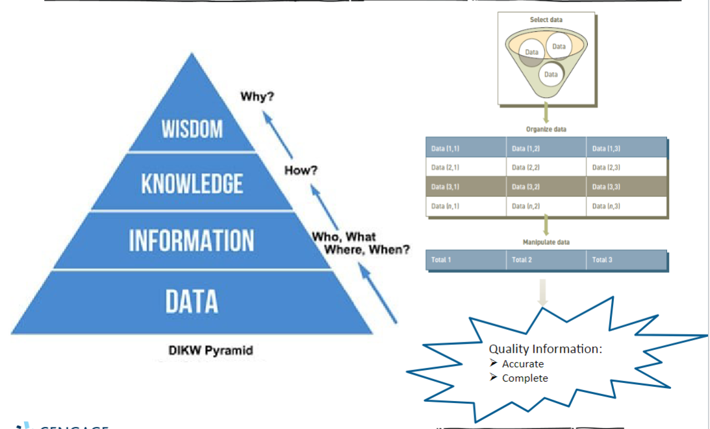

# An introduction to Information Systems 

## Learning Objectives:
#### After completing this chapter , we will be able to:
- distinguish data , information , and knowledge in the digital age.
- Identify fundamental components of Information Systems (IS).
- Identify types of fundamental IS in organizations.
- Describe the role of an organization's IT infrastructure.
- Discuss why it is critical for business objectives and IS activities to be aligned in organizations.
- Identify IS security threats as well as legal, social, and ethical issues associated with IS.
#### This is an overview chapter on topics covered in the semester.

## Data, Information , Knowledge , Wisdom
- Data - Basic , discrete , objective facts about something such as who, what, when, where ...
- Information - Collection of data organized and processed in such a way that they can add value; One of the most valuable organizational resources.
- Knowledge - Awareness and understanding of a systematic set of information and the ways it can be made useful.
- Wisdom - Knowledge to be applied to different situations. 
- Process or Procedure: A set of logically related tasks performed to achieve a defined outcome.
  > Turning data into information is a process / procedure.

#### Types of data 
|Data                     |Represented by
|-------------------------|----------------------------------------|
| Alphanumeric data       |Number , letters , and other characters 
| Audio data              |Sounds , noises , or tones
| Image data              |Graphic images and pictures
| Video data              |Moving images or pictures

#### Transforming Data into Information , Knowledge, and Wisdom:
  > Process & Procedure 

## What is an Information System (IS)?
An **information system** (IS) is a systematic set of interrelated elements that:
- Collect (input)
- Process
- Store
- Disseminate data and information.
- Provides a feedback mechanism to monitor and control its operations to make sure it continues to meet organizational goals and objectives.
A **Computer-based informations system** (CBIS) is a set of hardware , software, databases, network , people , and procedures.
- Configured to collect, manipulate , store , and process data information.
- A.K.A. computer information systems (CIS)
  
